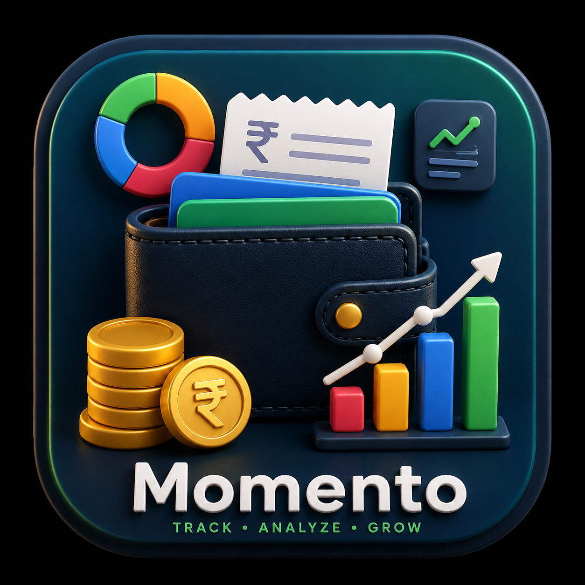

# Run and deploy your AI Studio app

This contains everything you need to run your app locally.

View your app in AI Studio: https://ai.studio/apps/6d40de99-dc2b-425e-9a04-63265cfa7664

## Run Locally

**Prerequisites:**  [Android Studio](https://developer.android.com/studio)

1. Open Android Studio
2. Select **Open** and choose the directory containing this project
3. Allow Android Studio to fix any incompatibilities as it imports the project.
4. Create a file named `.env` in the project directory and set `GEMINI_API_KEY` in that file to your Gemini API key (see `.env.example` for an example)
5. Remove this line from the app's `build.gradle.kts` file: `signingConfig = signingConfigs.getByName("debugConfig")`
6. Run the app on an emulator or physical device

**-----------------------------------------------------------------------------------------------------------------------------------------------------**
# 🚀 Momento - Your All-in-One Life Management Companion

> Simplify your life, stay organized, and achieve your goals with a single powerful platform.

## 🌟 About Momento

Momento is a modern all-in-one productivity and personal management application designed to help users organize every aspect of their daily lives. From expense tracking and task management to goal planning and productivity insights, Momento brings everything together in one seamless experience.

Built with Flutter, Momento delivers a fast, beautiful, and cross-platform experience that helps users stay focused, productive, and financially aware.

## ✨ Key Features

### 💰 Smart Expense Tracking

* Track income and expenses effortlessly
* Categorize spending habits
* Monitor financial health with detailed insights

### ✅ Task & Productivity Management

* Create and manage daily tasks
* Set priorities and deadlines
* Stay organized and improve productivity

### 🎯 Goal Planning

* Define personal and financial goals
* Track progress visually
* Build better habits over time

### 📊 Analytics & Insights

* Interactive charts and reports
* Spending and productivity trends
* Data-driven decision making

### 🔔 Smart Reminders

* Never miss important tasks
* Stay consistent with goals and routines

### 📱 Modern User Experience

* Clean and intuitive interface
* Responsive design
* Smooth cross-platform performance

## 🛠️ Tech Stack

* 🎯 Flutter
* 💙 Dart
* 🔥 Firebase / Backend Services
* 📊 Data Visualization
* ☁️ Cloud Integration
* 📱 Android Support

## 🚀 Vision

Momento aims to become a complete digital companion that empowers users to manage finances, boost productivity, build habits, and achieve personal growth—all from a single application.

## 🔮 Future Roadmap

* 🤖 AI-Powered Personal Assistant
* 📅 Calendar Integration
* 💳 UPI & Banking Insights
* ☁️ Multi-Device Sync
* 🎯 Habit Tracking System
* 📈 Advanced Analytics Dashboard
* 🧠 Personalized Recommendations

## 👨‍💻 Developer

Built with ❤️ by **Rohan N Karadigudd**

### ⭐ If you like this project, consider giving it a star and supporting its growth!
